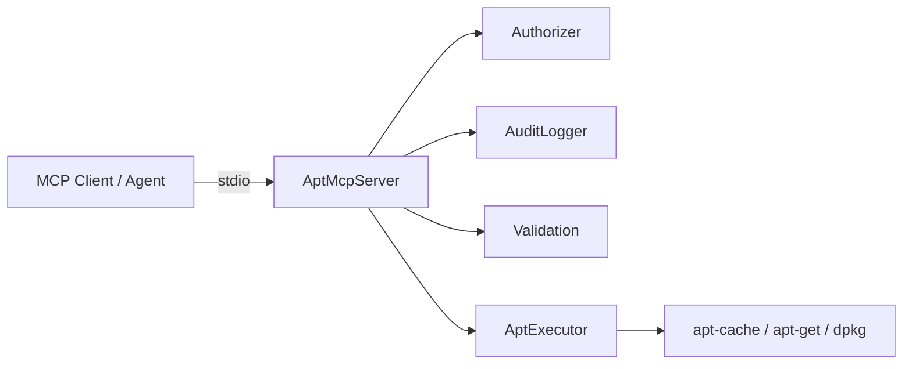
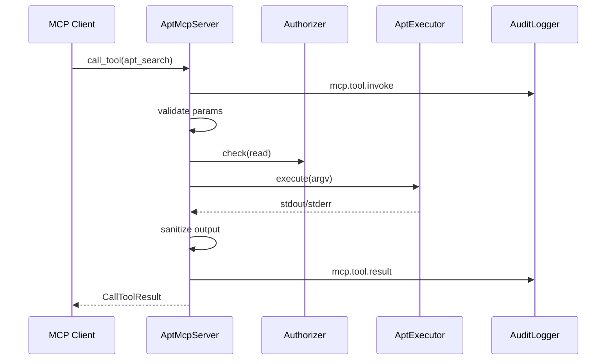

# Architecture

apt-mcp is a stdio MCP server written in Rust. It wraps apt-family CLI tools behind validated, scoped, audited tool handlers.

## Components

| Module | Role |
|--------|------|
| `server` | MCP tool definitions (rmcp), request orchestration |
| `auth` | Per-call scope checks (`read`, `mutate`) |
| `audit` | JSON-lines SIEM events per invocation |
| `validation` | Package name and input validation |
| `sanitize` | Output size caps and secret redaction |
| `apt::executor` | argv-based command execution (no shell) |
| `apt::commands` | Maps tools to apt argv vectors |

## Request flow

## Trust boundaries

- **Agent** connects via MCP host (Cursor, gateway). Production deployments should route through a filtering proxy per NSA MCP guidance.
- **Server** runs apt subprocesses with the invoking user's privileges. Container runs as non-root; apt mutations still need appropriate capabilities on the host.
- **No shell** — all commands are `exec` argv arrays to prevent injection.

## Transport

Stdio only (`rmcp::transport::stdio`). No network listener in the server process.

## Testing

`MockAptExecutor` records expected argv keys for unit tests. `RealAptExecutor` is used in production and integration environments with real apt.

## Related

- [Security](security.md)
- [Tools](features/tools.md)
